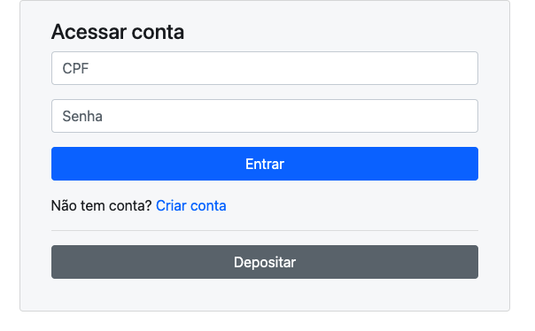

# Aplicação Carteira Financeira
Simulação de uma conta bancária, onde se pode criar conta, realizar depósitos, logar na conta, realizar tranferências e consultar extrato!

## Comando para buildar o projeto
`docker compose up  -d --build`

## Dados de Acesso ao Banco de Dados
`Host: localhost`
`User: root`
`Password: ''`
`DataBase: default-base`
`Port: 3307`

## Tabelas do Banco de Dados
Rode os comandos sql abaixo para criar as tabelas da aplicação

## PRINT da tela de início da aplicação
